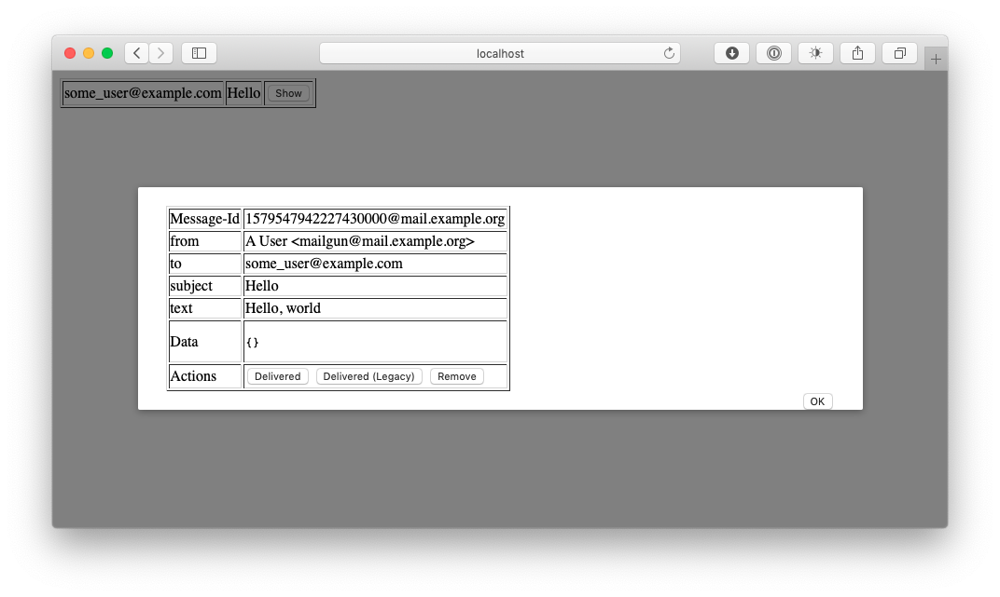

# mailgun-mock
Unofficial mailgun.com API service mock for development and testing



## Using

Pull and run the Docker image:

```bash
docker pull asedov/mailgun-mock
docker run --rm -it -p 8080:80 -e MAILGUN_API_KEY=key-example asedov/mailgun-mock
```

Navigate to http://localhost:8080 to view messages (automatically updates)

Post an example email to see it appear in the web browser:

```bash
curl -s --user 'api:key-example' http://localhost:8080/v3/mail.example.org/messages \
    -F from='A User <mailgun@mail.example.org>' \
    -F to=some_user@example.com \
    -F subject='Hello' \
    -F text='Hello, world'
```

### Environment Variables

* `MAILGUN_API_KEY`
* `MAILGUN_WEBHOOK_KEY`
* `MAILGUN_WEBHOOK_URL`
